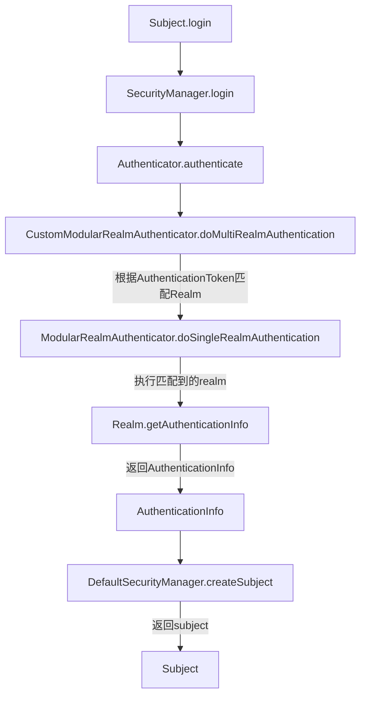

# springboot-shiro-jwt

#### 介绍

基于Springboot,shiro,mybatis-plus等开源框架构建的单体架构项目

接口文档地址：http://localhost:8888/doc.html

#### 项目用到的框架/工具简介与其仓库地址

* SpringBoot https://github.com/spring-projects/spring-boot/releases
* jwt https://github.com/auth0/java-jwt/tags
* mybatis-plus https://github.com/baomidou/mybatis-plus/releases
* shiro https://github.com/apache/shiro/tags
* hutool https://github.com/dromara/hutool/releases
* minio https://github.com/minio/minio-java/releases
* knife4j https://gitee.com/xiaoym/knife4j/releases
* mica-auto https://github.com/lets-mica/mica-auto/releases
* spring-javaformat https://github.com/spring-io/spring-javaformat/releases
* reflections https://github.com/ronmamo/reflections/releases

#### 其它项目

* 配套前端项目 https://gitee.com/knightdreams/vue3-mobile-login-demo
* 配套管理端项目 https://gitee.com/knightdreams/knightdreams-admin
* 微服务架构项目 https://gitee.com/knightdreams/spring-cloud-alibaba-2022

#### 认证流程

#### 使用说明

使用遇到问题可以加QQ群： 

欢迎您进群进行技术交流

如果此项目帮到您的话，欢迎star，您的star就是对我最大的鼓励

可以关注一下我的博客，不定期更新技术文章 https://knightdreams6.github.io/
